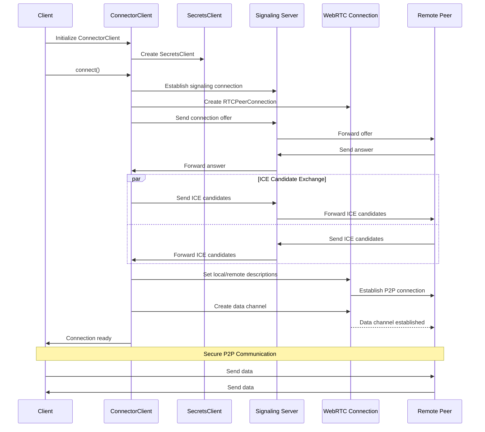

# Radix Connect WebRTC Client

## Install

`npm install @radixdlt/radix-connect-webrtc`

# License

The Radix Connect WebRTC Client binaries are licensed under the [Radix Software EULA](http://www.radixdlt.com/terms/genericEULA).

The Radix Connect WebRTC Client code is released under [Apache 2.0 license](LICENSE).

      Copyright 2023 Radix Publishing Ltd

      Licensed under the Apache License, Version 2.0 (the "License"); you may not use this file except in compliance with the License.

      You may obtain a copy of the License at: http://www.apache.org/licenses/LICENSE-2.0

      Unless required by applicable law or agreed to in writing, software distributed under the License is distributed on an "AS IS" BASIS, WITHOUT WARRANTIES OR CONDITIONS OF ANY KIND, either express or implied.

      See the License for the specific language governing permissions and limitations under the License.
